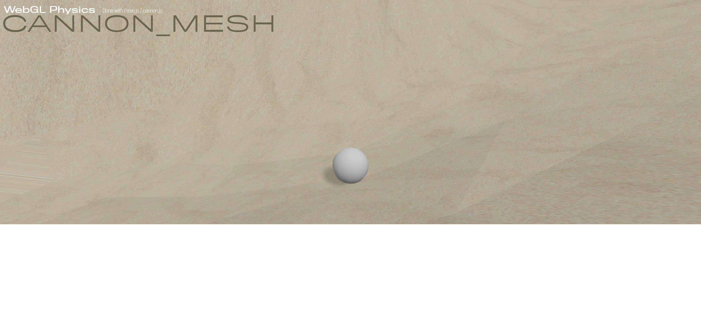

# Cannon-from-mesh

Three.js and Cannon.js experiment for physics ball game.

## Description

This project show how to setup a physical game ball with [three.js](https://threejs.org/) and Cannon.js.

Use arrows to control ball motion.

## Youtube video

Check the [video](https://youtu.be/Gviv4LZ7lPc) on youtube.
